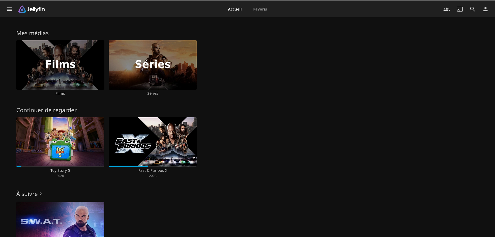

# Configuration — Jellyfin

## Fichier Docker Compose

```yaml
services:
  jellyfin:
    image: lscr.io/linuxserver/jellyfin:latest
    container_name: jellyfin
    environment:
      - PUID=1001
      - PGID=100
      - TZ=Africa/Ouagadougou
      - JELLYFIN_PublishedServerUrl=http://192.168.100.21
    volumes:
      - /srv/dev-disk-by-uuid-3c3cbb68-c5c9-40ca-99b2-23b19a49cc43/Docker/jellyfin/config:/config
      - /srv/dev-disk-by-uuid-3c3cbb68-c5c9-40ca-99b2-23b19a49cc43/media/series:/data/tvshows
      - /srv/dev-disk-by-uuid-3c3cbb68-c5c9-40ca-99b2-23b19a49cc43/media/films:/data/movies
    ports:
      - 8096:8096
      - 7359:7359/udp
      - 1900:1900/udp
    restart: unless-stopped
```

## Rôle de chaque port

| Port | Usage |
|---|---|
| `8096` | Interface web principale (HTTP) |
| `7359/udp` | Découverte automatique du serveur sur le réseau local (broadcast UDP, permet aux apps clientes de trouver le serveur sans taper l'IP manuellement) |
| `1900/udp` | Serveur DLNA — permet la lecture depuis des appareils sans app Jellyfin dédiée (téléviseurs plus anciens) |

Port `8920` (HTTPS) volontairement omis : nécessiterait un certificat SSL configuré sur Jellyfin, non mis en place pour l'instant.

## Accès depuis différents appareils

- **PC / navigateur** : `http://192.168.100.21:8096`
- **TV LG (modèles récents)** : application officielle disponible sur le LG Content Store
- **Sans application dédiée** : DLNA (détection automatique par la TV) ou lecture directe des fichiers via le partage SMB dans un lecteur comme VLC

## Transcodage matériel (Quick Sync) — non activé

Le CPU (i3-6100) dispose d'un GPU intégré compatible Quick Sync, qui aurait pu accélérer le transcodage vidéo. Non activé dans ce projet : cela nécessiterait soit un passthrough GPU complet vers la VM OMV (retirerait le GPU à l'hôte Proxmox pour toute autre VM), soit une configuration GVT-g plus complexe et moins stable sur ce matériel. Le transcodage reste donc en mode logiciel (CPU), suffisant pour l'usage actuel.


## Problème de transcodage forcé — résolu

**Symptôme** : le CPU montait à 100 % dès la lecture d'un film, même dans des cas où un transcodage n'aurait pas dû être nécessaire (Direct Play attendu).

**Cause** : l'option **"Préférer le conteneur de média fMP4-HLS"** (Réglages de lecture → Avancé) forçait un réempaquetage du flux, empêchant l'envoi direct et brut du fichier original.

**Solution** : décocher cette option dans les paramètres de lecture du client utilisé.

## Transcodage matériel (Quick Sync) — tenté et abandonné

Le CPU (i3-6100) dispose d'un GPU intégré (HD Graphics 530) compatible Quick Sync, qui aurait pu accélérer le transcodage vidéo côté serveur plutôt que de tout faire en logiciel sur le CPU.

### Tentative de passthrough complet vers la VM OMV

Étapes suivies, toutes validées individuellement :
- VT-d activé dans le BIOS, IOMMU activé côté Proxmox (`intel_iommu=on iommu=pt`)
- GPU confirmé isolé seul dans son propre groupe IOMMU (aucun autre périphérique à embarquer avec lui)
- Pilote `i915` blacklisté sur l'hôte, GPU correctement lié à `vfio-pci`
- VM basculée en machine type `q35` (requis pour le PCIe)
- PCI Device ajouté à la VM avec les options `x-vga=1` et opregion (spécifiques aux iGPU Intel, absentes des GPU discrets)

### Échec au démarrage

Malgré une configuration conforme aux guides communautaires (dont [3os.org](https://3os.org/infrastructure/proxmox/gpu-passthrough/igpu-passthrough-to-vm/)), la VM échouait systématiquement à démarrer (`got timeout`), avec un fault DMAR répété dans les logs :
```
DMAR: [DMA Write NO_PASID] Request device [00:02.0] fault addr 0x0 [fault reason 0x02] Present bit in context entry is clear
```

Correctifs communautaires testés sans succès : désactivation du memory ballooning, vérification de l'absence de conflit avec un second périphérique d'affichage (`vga: none`). Ce fault est documenté sur du matériel très proche (HD Graphics 530 sur un HP EliteDesk de génération équivalente), certains y arrivant, d'autres non, sans cause unique clairement identifiée dans la communauté.

### Alternative envisagée puis écartée : GVT-g

Intel GVT-g (passthrough médié, partagé entre l'hôte et la VM) aurait pu être une alternative moins radicale. Écarté car officiellement abandonné par Intel depuis octobre 2024 (plus aucune maintenance, correctif ou mise à jour), avec des retours d'expérience faisant état de crashs de VM même sur des configurations qui fonctionnaient initialement.

### Décision finale

Abandon du passthrough GPU. Le vrai goulot d'étranglement identifié n'était pas la présence ou non d'un GPU, mais des fichiers spécifiquement lourds à transcoder (HEVC 10-bit, HDR/Dolby Vision, audio multicanal EAC3) — confirmé via `top` montrant `ffmpeg` consommant à lui seul près de 3 cœurs sur les 3 alloués à la VM. Stratégie retenue : réencoder ces fichiers spécifiques à l'avance (HandBrake, en H.264 8-bit + AAC) plutôt que de chercher à accélérer le transcodage à la volée. Automatisation possible de ce réencodage via Tdarr, envisagée pour plus tard.


## Bibliothèques configurées

- **Films** → pointée vers `/data/movies` (alimentée par Radarr, voir [arr-stack-setup.md](arr-stack-setup.md))
- **Séries** → pointée vers `/data/tvshows` (alimentée par Sonarr)


