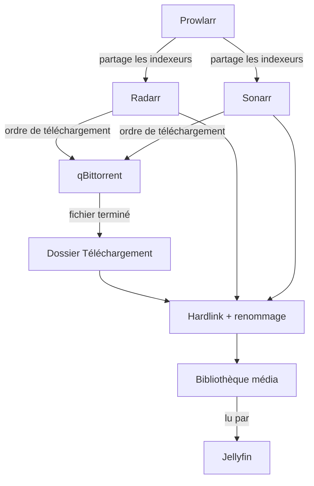
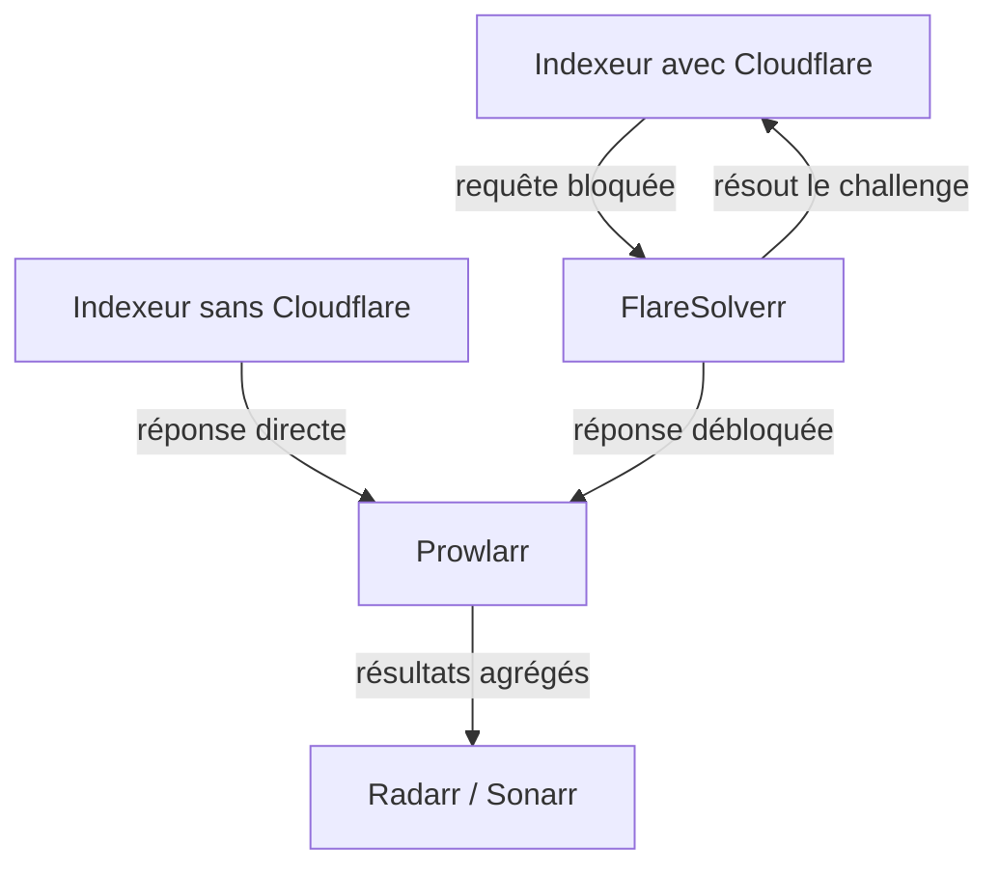

# Automatisation média — Arr Stack

Ce document détaille le fonctionnement de la chaîne d'automatisation utilisée pour la gestion des films et séries : recherche, téléchargement, tri, et mise à disposition dans la bibliothèque média.

## Vue d'ensemble du flux



## Rôle de chaque service

| Service          | Rôle                                                                                                                                                               |
| ---------------- | ------------------------------------------------------------------------------------------------------------------------------------------------------------------ |
| **Prowlarr**     | Centralise la configuration des indexeurs (sources de recherche) et les partage automatiquement à Radarr/Sonarr — évite de configurer les mêmes sources deux fois. |
| **Radarr**       | Gère la liste des films voulus, cherche via Prowlarr, envoie le téléchargement à qBittorrent, importe et renomme le fichier une fois terminé.                      |
| **Sonarr**       | Identique à Radarr mais pour les séries — surveille aussi les épisodes à venir d'une série en cours de diffusion.                                                  |
| **qBittorrent**  | Télécharge réellement les fichiers, piloté à distance par Radarr/Sonarr via API.                                                                                   |
| **FlareSolverr** | Résout les protections Cloudflare de certains indexeurs, agit comme proxy pour Prowlarr.                                                                           |
| **Jellyfin**     | Lit et diffuse la bibliothèque média organisée par Radarr/Sonarr.                                                                                                  |

## Organisation des dossiers

```
Telechargement/          (fichiers bruts téléchargés par qBittorrent)
Docker/
├── Data            # Data et config-files sont cree et gerer par docker
├── config-files
├── jellyfin
├── nextcloud
├── prowlarr
├── qbittorent
├── radarr
└── sonarr

```

## Pourquoi le dossier de telechargement or de docker
Le dossier a été volontairement mis hors de Docker car sur OMV fonctionne aussi un serveur de téléchargement d'autres fichiers personnels.

## Fonctionnement de Prowlarr et contournement Cloudflare

Prowlarr centralise les indexeurs (sources de recherche) et les partage à Radarr/Sonarr, plutôt que de les configurer séparément dans chaque application. Certains indexeurs sont protégés par une vérification Cloudflare que Prowlarr ne peut pas résoudre seul, n'ayant pas de navigateur — **FlareSolverr** intervient alors comme proxy intermédiaire, agissant comme un navigateur automatisé qui résout ce challenge à sa place.



L'association entre un indexeur et FlareSolverr se fait via un **système de tags** : le même tag (ex: `flaresolverr`) est appliqué à la fois sur le proxy FlareSolverr (Settings → Indexer Proxies) et sur l'indexeur concerné (Indexers → paramètres de l'indexeur) — Prowlarr applique alors automatiquement le proxy à tout indexeur partageant ce tag.

Détails de déploiement (fichier Compose, connexion à Prowlarr) : voir [arr-stack-setup.md](arr-stack-setup.md#résolution-cloudflare-flaresolverr).

## Hardlinks plutôt que copie

Radarr/Sonarr sont configurés avec l'option **"Use Hardlinks instead of Copy"** (Settings → Media Management). Un hardlink fait pointer deux emplacements (le dossier Téléchargement et la bibliothèque média) vers les **mêmes données physiques** sur le disque — le fichier n'existe qu'une seule fois en réalité, malgré son apparence dupliquée. Ça permet de :
- Continuer à seeder le torrent depuis le dossier Téléchargement (partage continu apprécié voire requis sur certains trackers)
- Ne pas gaspiller d'espace disque avec une vraie copie

***Condition*** : les hardlinks ne fonctionnent que si les deux dossiers sont sur le **même système de fichiers/partition**

## Configuration des permissions (compte technique)

Tous les conteneurs de cette stack utilisent un compte OMV dédié (`mediaAgent`), avec un PUID/PGID non-root — pas le compte administrateur personnel.  
***Objectif*** : limiter les dégâts possibles en cas de faille de sécurité dans un des services (l'accès resterait limité aux permissions de ce compte, jamais root sur l'hôte).

## Filtrage par langue (Custom Formats)

Sonarr/Radarr acceptent par défaut n'importe quelle langue trouvée. Pour prioriser le français, des **Custom Formats** ont été créés (Settings → Custom Formats), basés sur une détection par expression régulière du titre de la release :

| Custom Format | Détecte                                   | Score attribué |
| ------------- | ----------------------------------------- | -------------- |
| `Multi`       | `MULTI`                                   | 100            |
| `french`      | `FRENCH`, `VFF`, `TRUEFRENCH`, `VF`, `FR` | 80             |
| `vostfr`      | `VOSTFR`, `SUBFRENCH`                     | 10             |

Ces scores sont ensuite appliqués dans le profil de qualité (Settings → Profiles), avec :
- **Minimum Custom Format Score = 1** — rejette toute release sans aucun tag détecté (évite de récupérer une version 100% anglaise par défaut)
- **Upgrade Until Custom Format Score = 100** — permet à Sonarr/Radarr de remplacer automatiquement une version déjà téléchargée par une meilleure (ex: passer de VOSTFR à MULTI si une meilleure version sort plus tard)

## Limite connue

Le parsing (analyse du titre) de Radarr/Sonarr suppose que l'année suit immédiatement le titre du film/série (`Titre.2024.TAGS`). Un titre non conventionnel comme `Titre TAGS 2024` (année à la fin) peut ne pas être reconnu correctement — dans ce cas, un import manuel (Radarr/Sonarr → Manual Import) reste possible en dernier recours.

## Pour aller plus loin

Configuration technique détaillée (fichiers Docker Compose, étapes précises) : voir [arr-stack-setup.md](arr-stack-setup.md) et [jellyfin-setup.md](jellyfin-setup.md).