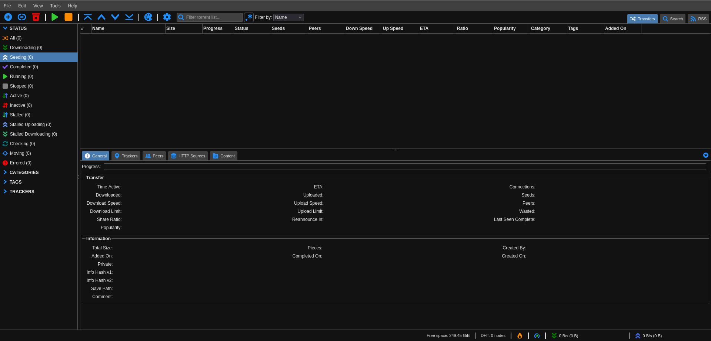

# Configuration de QBittorent

## Fichier Docker Compose

```yaml
---
services:
  qbittorrent:
    image: lscr.io/linuxserver/qbittorrent:latest
    container_name: qbittorrent
    environment:
      - PUID=1001 # identifiant de mediaAgent
      - PGID=100
      - TZ=Africa/Ouagadougou
      - WEBUI_PORT=8081
      - TORRENTING_PORT=6881
    volumes:
      - /srv/dev-disk-by-uuid-3c3cbb68-c5c9-40ca-99b2-23b19a49cc43/Docker/qbittorent/config:/config
      - /srv/dev-disk-by-uuid-3c3cbb68-c5c9-40ca-99b2-23b19a49cc43/Telechargement:/downloads
    ports:
      - 8081:8081
      - 6881:6881
      - 6881:6881/udp
    stop_grace_period: "10s" #optional
    restart: unless-stopped

```

## Rôle de chaque port

| Port       | Usage                                             |
| ---------- | ------------------------------------------------- |
| `8081`     | Interface web principale                          |
| `6881`     | port utilisé pour le téléchargement des torrents |
| `6881/udp` | utiliser le protocole UDP au lieu du TCP          |

⚠️ Le `WEBUI_PORT` doit impérativement etre pareil que port rediriger vers l’hôte (OMV) car risque d'un acces non autoriser a la page ([Plus d'info](../README.md#qbittorrent--acces-nom-autoriser-a-linterface-web))


## Accès a l'interface

L'accès a l'interface se fait a partir du portail a l’adresse `192.168.100.6:8081`

